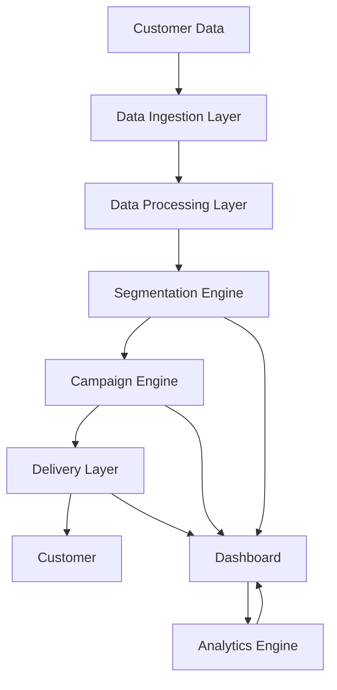

```markdown
# Technical Specification: win-back-tracker

## Architecture Overview

The win-back-tracker system is designed to be a scalable, modular, and extensible platform for automating win-back campaigns for retailers. The architecture follows a microservices approach, ensuring loose coupling and high cohesion among components.

### High-Level Architecture Diagram



## Components

### 1. Data Ingestion Layer
- **Purpose**: Collects customer data from various sources (POS, CRM, etc.).
- **Technologies**: Apache Kafka, REST APIs, CSV parsers.
- **Responsibilities**:
  - Ingest data from multiple sources.
  - Validate and clean data before processing.

### 2. Data Processing Layer
- **Purpose**: Processes and transforms raw data into a structured format.
- **Technologies**: Apache Spark, Python (Pandas, NumPy).
- **Responsibilities**:
  - Transform raw data into a standardized format.
  - Perform initial data enrichment.

### 3. Segmentation Engine
- **Purpose**: Identifies high-value lapsed customers using machine learning.
- **Technologies**: Scikit-learn, TensorFlow, PyTorch.
- **Responsibilities**:
  - Apply machine learning models to segment customers.
  - Generate lists of high-value lapsed customers.

### 4. Campaign Engine
- **Purpose**: Generates personalized win-back offers.
- **Technologies**: Python (Flask/Django), Rule-based engines.
- **Responsibilities**:
  - Create personalized offers (discounts, bundles, loyalty points).
  - Manage campaign logic and rules.

### 5. Delivery Layer
- **Purpose**: Delivers win-back messages via multiple channels.
- **Technologies**: Email (SendGrid), SMS (Twilio), Push Notifications (Firebase), In-store Kiosks (Custom API).
- **Responsibilities**:
  - Send messages via selected channels.
  - Handle delivery failures and retries.

### 6. Dashboard
- **Purpose**: Provides real-time insights into win-back performance.
- **Technologies**: React, D3.js, Grafana.
- **Responsibilities**:
  - Visualize key metrics (revenue recovered, conversion rates).
  - Provide real-time analytics and reporting.

### 7. Analytics Engine
- **Purpose**: Analyzes campaign performance and customer behavior.
- **Technologies**: Apache Spark, Python (Pandas, NumPy).
- **Responsibilities**:
  - Perform advanced analytics on campaign data.
  - Generate insights and recommendations.

## Data Model

### Core Entities

1. **Customer**
   - `customer_id`: Unique identifier.
   - `name`: Customer name.
   - `email`: Email address.
   - `phone`: Phone number.
   - `last_purchase_date`: Date of last purchase.
   - `total_spend`: Total amount spent.
   - `segment`: Customer segment (e.g., high-value, lapsed).

2. **Campaign**
   - `campaign_id`: Unique identifier.
   - `name`: Campaign name.
   - `start_date`: Start date.
   - `end_date`: End date.
   - `target_segment`: Target customer segment.
   - `offer`: Offer details (discount, bundle, loyalty points).

3. **Delivery**
   - `delivery_id`: Unique identifier.
   - `campaign_id`: Associated campaign.
   - `customer_id`: Target customer.
   - `channel`: Delivery channel (email, SMS, push, in-store).
   - `status`: Delivery status (sent, failed, delivered).
   - `timestamp`: Delivery timestamp.

4. **Analytics**
   - `analytics_id`: Unique identifier.
   - `campaign_id`: Associated campaign.
   - `metric`: Metric name (e.g., conversion rate, revenue recovered).
   - `value`: Metric value.
   - `timestamp`: Timestamp of the metric.

## Key APIs/Interfaces

### 1. Data Ingestion API
- **Endpoint**: `/api/data/ingest`
- **Method**: POST
- **Description**: Ingests customer data from various sources.
- **Request Body**:
  ```json
  {
    "source": "POS",
    "data": [
      {
        "customer_id": "123",
        "name": "John Doe",
        "email": "john@example.com",
        "phone": "1234567890",
        "last_purchase_date": "2023-01-01",
        "total_spend": 1000
      }
    ]
  }
  ```

### 2. Campaign Management API
- **Endpoint**: `/api/campaigns`
- **Methods**: GET, POST, PUT, DELETE
- **Description**: Manages win-back campaigns.
- **Request Body (POST)**:
  ```json
  {
    "name": "Summer Sale",
    "start_date": "2023-06-01",
    "end_date": "2023-06-30",
    "target_segment": "high-value",
    "offer": {
      "type": "discount",
      "value": 10
    }
  }
  ```

### 3. Delivery API
- **Endpoint**: `/api/deliveries`
- **Methods**: GET, POST
- **Description**: Manages message deliveries.
- **Request Body (POST)**:
  ```json
  {
    "campaign_id": "456",
    "customer_id": "123",
    "channel": "email",
    "message": "Thank you for your loyalty! Here's a 10% discount on your next purchase."
  }
  ```

### 4. Analytics API
- **Endpoint**: `/api/analytics`
- **Methods**: GET
- **Description**: Retrieves analytics data.
- **Response Body**:
  ```json
  {
    "campaign_id": "456",
    "metrics": [
      {
        "name": "conversion_rate",
        "value": 0.15
      },
      {
        "name": "revenue_recovered",
        "value": 15000
      }
    ]
  }
  ```

## Tech Stack

- **Programming Languages**: Python, JavaScript
- **Frameworks**: Flask/Django (Python), React (JavaScript)
- **Databases**: PostgreSQL, MongoDB
- **Message Broker**: Apache Kafka
- **Analytics**: Apache Spark, D3.js
- **Deployment**: Docker, Kubernetes

## Dependencies

### External Dependencies
- **Apache Kafka**: For data ingestion and message delivery.
- **SendGrid**: For email delivery.
- **Twilio**: For SMS delivery.
- **Firebase**: For push notifications.
- **Grafana**: For real-time dashboard.

### Internal Dependencies
- **Data Processing Layer**: Depends on Apache Spark and Python libraries (Pandas, NumPy).
- **Segmentation Engine**: Depends on Scikit-learn, TensorFlow, PyTorch.
- **Campaign Engine**: Depends on Python (Flask/Django) and rule-based engines.
- **Delivery Layer**: Depends on external APIs (SendGrid, Twilio, Firebase).
- **Dashboard**: Depends on React and D3.js.
- **Analytics Engine**: Depends on Apache Spark and Python libraries (Pandas, NumPy).

## Deployment

### Prerequisites
- Docker
- Kubernetes
- Helm

### Deployment Steps

1. **Build Docker Images**:
   ```bash
   docker build -t win-back-tracker/data-ingestion .
   docker build -t win-back-tracker/data-processing .
   docker build -t win-back-tracker/segmentation-engine .
   docker build -t win-back-tracker/campaign-engine .
   docker build -t win-back-tracker/delivery-layer .
   docker build -t win-back-tracker/dashboard .
   docker build -t win-back-tracker/analytics-engine .
   ```

2. **Deploy to Kubernetes**:
   ```bash
   helm install win-back-tracker ./charts/win-back-tracker
   ```

3. **Verify Deployment**:
   ```bash
   kubectl get pods
   kubectl get services
   ```

### Configuration

- **Environment Variables**: Configure environment variables for each component in the Kubernetes deployment YAML files.
- **Secrets Management**: Use Kubernetes Secrets to manage sensitive information (API keys, database credentials).

### Monitoring and Logging

- **Monitoring**: Use Prometheus and Grafana for monitoring.
- **Logging**: Use ELK Stack (Elasticsearch, Logstash, Kibana) for logging.

## Conclusion

The win-back-tracker system is designed to be a robust, scalable, and extensible platform for automating win-back campaigns. By leveraging modern technologies and best practices, it ensures high performance, reliability, and ease of integration with existing retail systems.
```
